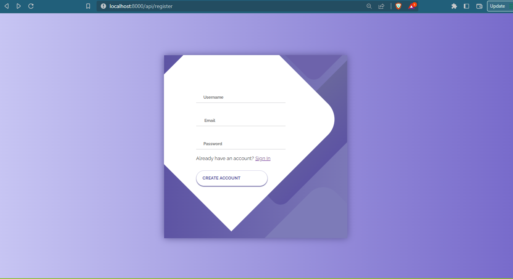
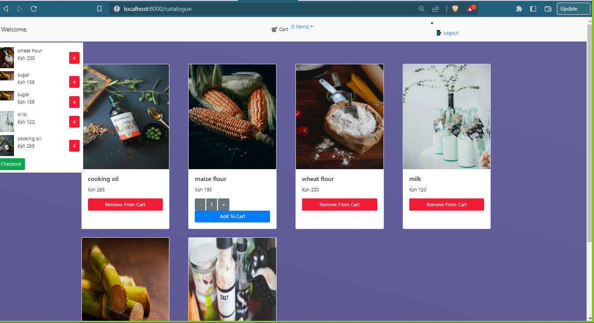

<p align="center"><a href="https://laravel.com" target="_blank"></a></p>


## About The Project

Muturi's App is an online store whereby a person can order products such as flour and other cooking ingredients. 

In order to place an order one has to have a registered account. The online store offers a user friendly and responsive interface to a visitor. 

On chekout one can then chose to have the items delivered to them and flexible payment options either during checkout or chose the cash on delivery optiom

## Setting Up The Project

1. Clone the project onto your laptop


2. Install Composer dependencies as follows:
   
   ```composer install```
   
3. Copy the `.env.example` into `.env`
   
4. Create a database, and add the associated credentials into the `.env` file.
- Or you can import the `muturis.sql` file into your SQL databases.
5.  Run `php artisan migrate` to execute Database Migrations.

That's it. You're free to explore the project.
   


## Screenshots


